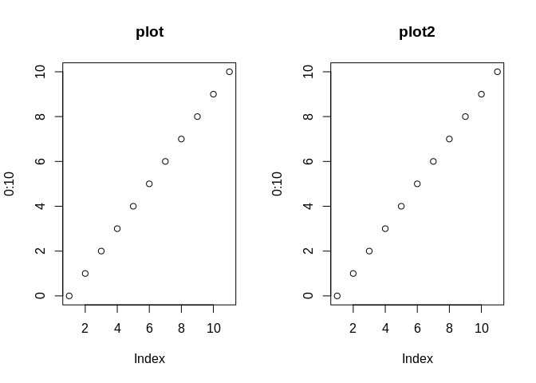
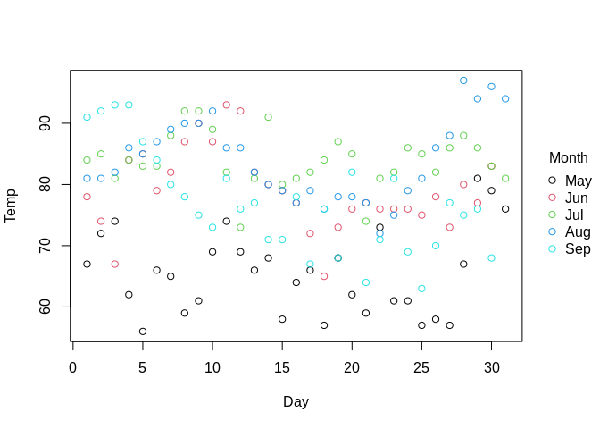
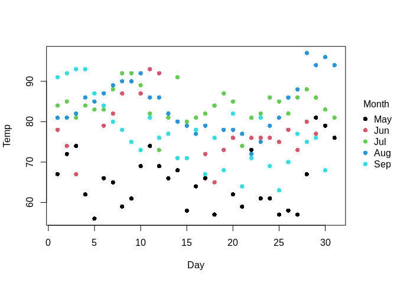
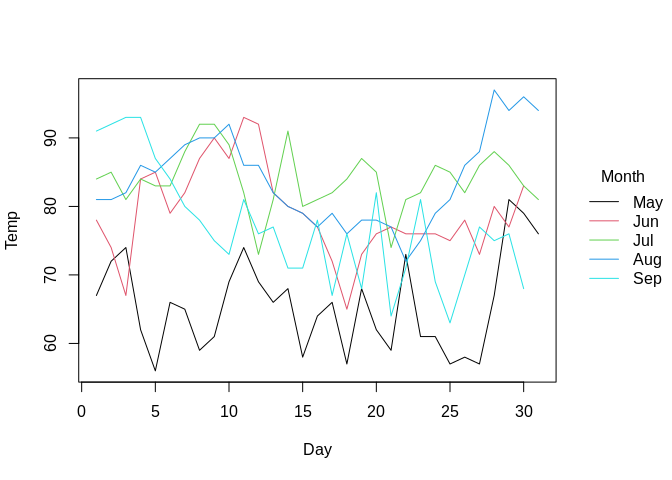
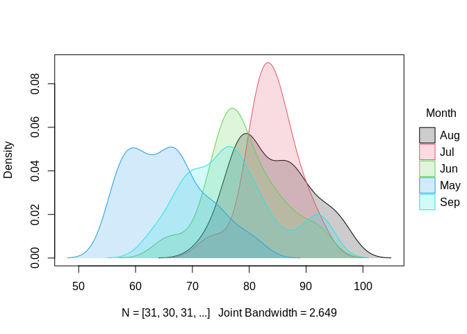
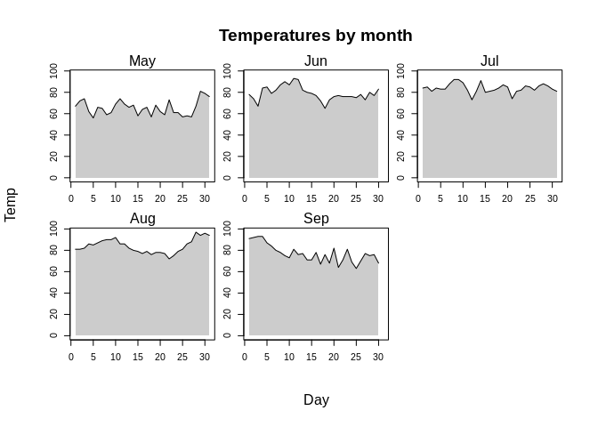
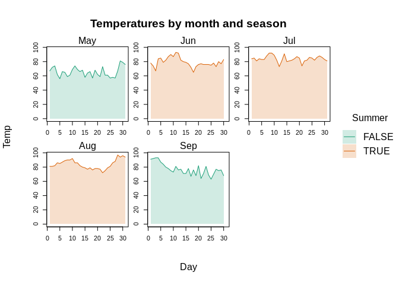
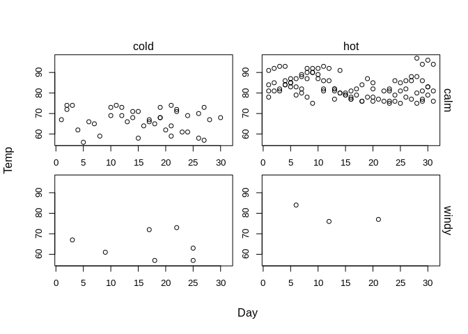
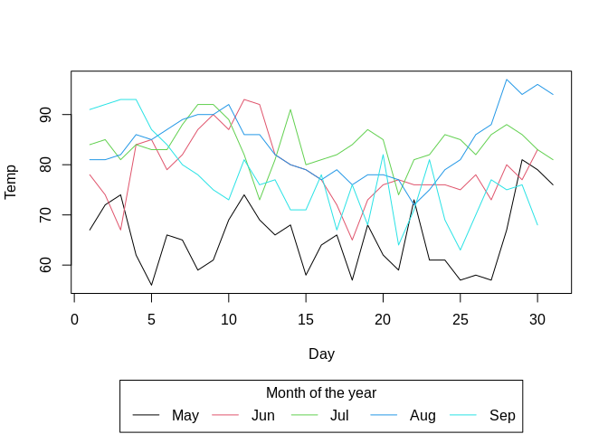
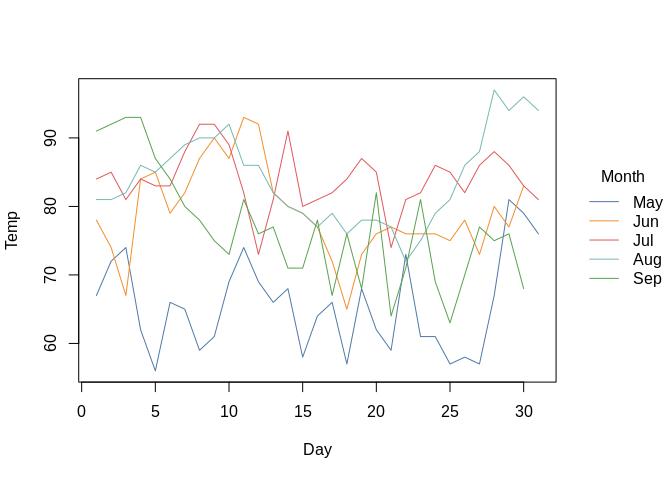

# plot2

[**Source code**](https://github.com/grantmcdermott/plot2/tree/main/R/#L)

Lightweight extension of the base R plotting function

## Description

Extends base R’s default plotting function, particularly as it applies
to scatter and line plots with grouped data. For example,
<code>plot2</code> makes it easy to plot different categories of a
dataset in a single function call and highlight these categories
(groups) using modern colour palettes. Coincident with this grouping
support, <code>plot2</code> also produces automatic legends with scope
for further customization. While the package also offers several other
enhancements, it tries as far as possible to be a drop-in replacement
for the equivalent base plot function. Users should generally be able to
swap a valid <code>plot</code> call with <code>plot2</code> without any
changes to the output.

## Usage

<pre><code class='language-R'>plot2(x, ...)

# Default S3 method:
plot2(
  x,
  y = NULL,
  by = NULL,
  data = NULL,
  type = "p",
  xlim = NULL,
  ylim = NULL,
  log = "",
  main = NULL,
  sub = NULL,
  xlab = NULL,
  ylab = NULL,
  ann = par("ann"),
  axes = TRUE,
  frame.plot = axes,
  asp = NA,
  grid = NULL,
  palette = NULL,
  legend = NULL,
  pch = NULL,
  lty = NULL,
  col = NULL,
  bg = NULL,
  fill = NULL,
  cex = 1,
  par_restore = FALSE,
  ymin = NULL,
  ymax = NULL,
  ribbon_alpha = 0.2,
  add = FALSE,
  ...
)

# S3 method for class 'formula'
plot2(
  x = NULL,
  data = parent.frame(),
  type = "p",
  xlim = NULL,
  ylim = NULL,
  main = NULL,
  sub = NULL,
  xlab = NULL,
  ylab = NULL,
  ann = par("ann"),
  axes = TRUE,
  frame.plot = axes,
  asp = NA,
  grid = NULL,
  pch = NULL,
  col = NULL,
  lty = NULL,
  par_restore = FALSE,
  formula = NULL,
  subset = NULL,
  na.action = NULL,
  drop.unused.levels = TRUE,
  ...
)

# S3 method for class 'density'
plot2(
  x = NULL,
  by = NULL,
  type = c("l", "area"),
  xlim = NULL,
  ylim = NULL,
  main = NULL,
  sub = NULL,
  xlab = NULL,
  ylab = NULL,
  ann = par("ann"),
  axes = TRUE,
  frame.plot = axes,
  asp = NA,
  grid = NULL,
  pch = NULL,
  col = NULL,
  lty = NULL,
  bg = NULL,
  fill = NULL,
  par_restore = FALSE,
  ...
)
</code></pre>

## Arguments

<table>
<tr>
<td style="white-space: nowrap; font-family: monospace; vertical-align: top">
<code id="plot2_:_x">x</code>, <code id="plot2_:_y">y</code>
</td>
<td>
the x and y arguments provide the x and y coordinates for the plot. Any
reasonable way of defining the coordinates is acceptable. See the
function xy.coords for details. If supplied separately, they must be of
the same length.
</td>
</tr>
<tr>
<td style="white-space: nowrap; font-family: monospace; vertical-align: top">
<code id="plot2_:_...">…</code>
</td>
<td>
other <code>graphical</code> parameters (see <code>par</code> and also
the "Details" section of <code>plot</code>).
</td>
</tr>
<tr>
<td style="white-space: nowrap; font-family: monospace; vertical-align: top">
<code id="plot2_:_by">by</code>
</td>
<td>
the grouping variable(s) that you want to categorize (i.e., colour) the
plot by.
</td>
</tr>
<tr>
<td style="white-space: nowrap; font-family: monospace; vertical-align: top">
<code id="plot2_:_data">data</code>
</td>
<td>
a data.frame (or list) from which the variables in formula should be
taken. A matrix is converted to a data frame.
</td>
</tr>
<tr>
<td style="white-space: nowrap; font-family: monospace; vertical-align: top">
<code id="plot2_:_type">type</code>
</td>
<td>

character string giving the type of plot desired. Options are:

<ul>
<li>

The same set of 1-character values supported by plot: "p" for points,
"l" for lines, "b" for both points and lines, "c" for empty points
joined by lines, "o" for overplotted points and lines, "s" and "S" for
stair steps and "h" for histogram-like vertical lines. "n" does not
produce any points or lines.

</li>
<li>

Additional plot2 types: "density" for densities, "pointrange" or
"errorbar" for segement intervals, and "ribbon" or "area" for polygon
intervals (where area plots are a special case of ribbon plots with
<code>ymin</code> set to 0 and <code>ymax</code> set to <code>y</code>;
see below).

</li>
</ul>
</td>
</tr>
<tr>
<td style="white-space: nowrap; font-family: monospace; vertical-align: top">
<code id="plot2_:_xlim">xlim</code>
</td>
<td>
the x limits (x1, x2) of the plot. Note that x1 \> x2 is allowed and
leads to a ‘reversed axis’. The default value, NULL, indicates that the
range of the <code>finite</code> values to be plotted should be used.
</td>
</tr>
<tr>
<td style="white-space: nowrap; font-family: monospace; vertical-align: top">
<code id="plot2_:_ylim">ylim</code>
</td>
<td>
the y limits of the plot.
</td>
</tr>
<tr>
<td style="white-space: nowrap; font-family: monospace; vertical-align: top">
<code id="plot2_:_log">log</code>
</td>
<td>
a character string which contains "x" if the x axis is to be
logarithmic, "y" if the y axis is to be logarithmic and "xy" or "yx" if
both axes are to be logarithmic.
</td>
</tr>
<tr>
<td style="white-space: nowrap; font-family: monospace; vertical-align: top">
<code id="plot2_:_main">main</code>
</td>
<td>
a main title for the plot, see also <code>title</code>.
</td>
</tr>
<tr>
<td style="white-space: nowrap; font-family: monospace; vertical-align: top">
<code id="plot2_:_sub">sub</code>
</td>
<td>
a subtitle for the plot.
</td>
</tr>
<tr>
<td style="white-space: nowrap; font-family: monospace; vertical-align: top">
<code id="plot2_:_xlab">xlab</code>
</td>
<td>
a label for the x axis, defaults to a description of x.
</td>
</tr>
<tr>
<td style="white-space: nowrap; font-family: monospace; vertical-align: top">
<code id="plot2_:_ylab">ylab</code>
</td>
<td>
a label for the y axis, defaults to a description of y.
</td>
</tr>
<tr>
<td style="white-space: nowrap; font-family: monospace; vertical-align: top">
<code id="plot2_:_ann">ann</code>
</td>
<td>
a logical value indicating whether the default annotation (title and x
and y axis labels) should appear on the plot.
</td>
</tr>
<tr>
<td style="white-space: nowrap; font-family: monospace; vertical-align: top">
<code id="plot2_:_axes">axes</code>
</td>
<td>
a logical value indicating whether both axes should be drawn on the
plot. Use `graphical parameter` "xaxt" or "yaxt" to suppress just one of
the axes.
</td>
</tr>
<tr>
<td style="white-space: nowrap; font-family: monospace; vertical-align: top">
<code id="plot2_:_frame.plot">frame.plot</code>
</td>
<td>
a logical indicating whether a box should be drawn around the plot. Can
also use <code>frame</code> as an acceptable argument alias.
</td>
</tr>
<tr>
<td style="white-space: nowrap; font-family: monospace; vertical-align: top">
<code id="plot2_:_asp">asp</code>
</td>
<td>
the y/xy/x aspect ratio, see <code>plot.window</code>.
</td>
</tr>
<tr>
<td style="white-space: nowrap; font-family: monospace; vertical-align: top">
<code id="plot2_:_grid">grid</code>
</td>
<td>

argument for plotting a background panel grid, one of either:

<ul>
<li>

a logical (i.e., <code>TRUE</code> to draw the grid), or

</li>
<li>

a panel grid plotting function like <code>grid()</code>. Note that this
argument replaces the <code>panel.first</code> and
<code>panel.last</code> arguments from base <code>plot()</code> and
tries to make the process more seemless with better default behaviour.
Default is not to draw a grid.

</li>
</ul>
</td>
</tr>
<tr>
<td style="white-space: nowrap; font-family: monospace; vertical-align: top">
<code id="plot2_:_palette">palette</code>
</td>
<td>

one of the following options:

<ul>
<li>

NULL (default), in which case the palette will be determined by the the
user’s default graphics palette, e.g. "R4". See <code>?palette()</code>.
Note that some internal checking is done to make sure that resulting
colours match the number of groups. For larger group numbers, the
"viridis" palette will be used instead.

</li>
<li>

A convenience string corresponding to one of the many palettes listed by
either <code>palette.pals()</code> or <code>hcl.pals()</code>. Note that
the string can be case-insensitive (e.g., "Okabe-Ito" and "okabe-ito"
are both valid).

</li>
<li>

A palette-generating function. This can be "bare" (e.g.,
<code>palette.colors</code>) or "closed" with a set of named arguments
(e.g., <code>palette.colors(palette = “Okabe-Ito”, alpha = 0.5)</code>).
Note that any unnamed arguments will be ignored and the key
<code>n</code> argument, denoting the number of colours, will
automatically be spliced in as the number of groups.

</li>
</ul>
</td>
</tr>
<tr>
<td style="white-space: nowrap; font-family: monospace; vertical-align: top">
<code id="plot2_:_legend">legend</code>
</td>
<td>

one of the following options:

<ul>
<li>

NULL (default), in which case the legend will be determined by the
grouping variable. If there is no group variable (i.e., <code>by</code>
is NULL) then no legend is drawn. If a grouping variable is detected,
then an automatic legend is drawn to the <em>outer</em> right of the
plotting area. Note that the legend title and categories will
automatically be inferred from the <code>by</code> argument and
underlying data.

</li>
<li>

A convenience string indicating the legend position. The string should
correspond to one of the position keywords supported by the base
<code>legend</code> function, e.g. "right", "topleft", "bottom", etc. In
addition, <code>plot2</code> supports adding a trailing exclamation
point to these keywords, e.g. "right!", "topleft!", or "bottom!". This
will place the legend <em>outside</em> the plotting area and adjust the
margins of the plot accordingly. Finally, users can also turn off any
legend printing by specifying "none".

</li>
<li>

Logical value, where TRUE corresponds to the default case above (same
effect as specifying NULL) and FALSE turns the legend off (same effect
as specifying "none").

</li>
<li>

A list or, equivalently, a dedicated <code>legend()</code> function with
supported legend arguments, e.g. "bty", "horiz", and so forth.

</li>
</ul>
</td>
</tr>
<tr>
<td style="white-space: nowrap; font-family: monospace; vertical-align: top">
<code id="plot2_:_pch">pch</code>
</td>
<td>
plotting "character", i.e., symbol to use. Character, integer, or vector
of length equal to the number of categories in the <code>by</code>
variable. See <code>pch</code>. In addition, users can supply a special
<code>pch = “by”</code> convenience argument, in which case the
characters will automatically loop over the number groups. This
automatic looping will begin at the global character value (i.e.,
<code>par(“pch”)</code>) and recycle as necessary.
</td>
</tr>
<tr>
<td style="white-space: nowrap; font-family: monospace; vertical-align: top">
<code id="plot2_:_lty">lty</code>
</td>
<td>
line type. Character, integer, or vector of length equal to the number
of categories in the <code>by</code> variable. See <code>lty</code>. In
addition, users can supply a special <code>lty = “by”</code> convenience
argument, in which case the line type will automatically loop over the
number groups. This automatic looping will begin at the global line type
value (i.e., <code>par(“lty”)</code>) and recycle as necessary.
</td>
</tr>
<tr>
<td style="white-space: nowrap; font-family: monospace; vertical-align: top">
<code id="plot2_:_col">col</code>
</td>
<td>
plotting color. Character, integer, or vector of length equal to the
number of categories in the <code>by</code> variable. See
<code>col</code>. Note that the default behaviour in <code>plot2</code>
is to vary group colors along any variables declared in the
<code>by</code> argument. Thus, specifying colors manually should not be
necessary unless users wish to override the automatic colors produced by
this grouping process. Typically, this would only be done if grouping
features are deferred to some other graphical parameter (i.e., passing
the "by" keyword to one of <code>pch</code>, <code>lty</code>, or
<code>bg</code>; see below.)
</td>
</tr>
<tr>
<td style="white-space: nowrap; font-family: monospace; vertical-align: top">
<code id="plot2_:_bg">bg</code>
</td>
<td>
background fill color for the open plot symbols 21:25 (see
<code>points.default</code>), as well as ribbon and area plot types. For
the latter group—including filled density plots—an automatic alpha
transparency adjustment will be applied (see the
<code>ribbon_alpha</code> argument further below). Users can also supply
a special <code>bg = “by”</code> convenience argument, in which case the
background fill will inherit the automatic group coloring intended for
the <code>col</code> argument. Note that this grouped inheritance will
persist even if the <code>col</code> defaults are themselves overridden.
For example, <code>plot2(y ~ x | z, data = fakedata, pch = 22, col =
“blue”, bg = “by”)</code> will yield filled squares with a blue border.
</td>
</tr>
<tr>
<td style="white-space: nowrap; font-family: monospace; vertical-align: top">
<code id="plot2_:_fill">fill</code>
</td>
<td>
alias for <code>bg</code>. If non-NULL values for both <code>bg</code>
and <code>fill</code> are provided, then the latter will be ignored in
favour of the former.
</td>
</tr>
<tr>
<td style="white-space: nowrap; font-family: monospace; vertical-align: top">
<code id="plot2_:_cex">cex</code>
</td>
<td>
character expansion. A numerical vector (can be a single value) giving
the amount by which plotting characters and symbols should be scaled
relative to the default. Note that NULL is equivalent to 1.0, while NA
renders the characters invisible.
</td>
</tr>
<tr>
<td style="white-space: nowrap; font-family: monospace; vertical-align: top">
<code id="plot2_:_par_restore">par_restore</code>
</td>
<td>
a logical value indicating whether the <code>par</code> settings prior
to calling <code>plot2</code> should be restored on exit. Defaults to
FALSE, which makes it possible to add elements to the plot after it has
been drawn. However, note the the outer margins of the graphics device
may have been altered to make space for the <code>plot2</code> legend.
Users can opt out of this persistent behaviour by setting to TRUE
instead. (Another option would be calling <code>dev.off()</code> to
reset all <code>par</code> settings to their defaults.)
</td>
</tr>
<tr>
<td style="white-space: nowrap; font-family: monospace; vertical-align: top">
<code id="plot2_:_ymin">ymin</code>, <code id="plot2_:_ymax">ymax</code>
</td>
<td>
minimum and maximum coordinates of interval plot types. Only used when
the <code>type</code> argument is one of "pointrange", "errorbar", or
"ribbon".
</td>
</tr>
<tr>
<td style="white-space: nowrap; font-family: monospace; vertical-align: top">
<code id="plot2_:_ribbon_alpha">ribbon_alpha</code>
</td>
<td>
numeric factor modifying the opacity alpha of any ribbon shading;
typically in `[0, 1]`. Default value is 0.2. Only used when <code>type =
“ribbon”</code>, or when the <code>bg</code> fill argument is specified
in a density plot (since filled density plots are converted to ribbon
plots internally).
</td>
</tr>
<tr>
<td style="white-space: nowrap; font-family: monospace; vertical-align: top">
<code id="plot2_:_add">add</code>
</td>
<td>
logical. If TRUE, then elements are added to the current plot rather
than drawing a new plot window. Note that the automatic legend for the
added elements will be turned off.
</td>
</tr>
<tr>
<td style="white-space: nowrap; font-family: monospace; vertical-align: top">
<code id="plot2_:_formula">formula</code>
</td>
<td>
a <code>formula</code> that optionally includes grouping variable(s)
after a vertical bar, e.g. <code>y ~ x | z</code>. One-sided formulae
are also permitted, e.g. <code>~ y | z</code>. Note that the
<code>formula</code> and <code>x</code> arguments should not be
specified in the same call.
</td>
</tr>
<tr>
<td style="white-space: nowrap; font-family: monospace; vertical-align: top">
<code id="plot2_:_subset">subset</code>,
<code id="plot2_:_na.action">na.action</code>,
<code id="plot2_:_drop.unused.levels">drop.unused.levels</code>
</td>
<td>
arguments passed to <code>model.frame</code> when extracting the data
from <code>formula</code> and <code>data</code>.
</td>
</tr>
</table>

## Examples

``` r
library(plot2)


# save graphics paramaters to restore them later
op <- par()


# plot2 should be a drop-in replacement for (most) regular plot calls. For
# example:

par(mfrow = c(1, 2))
plot(0:10, main = "plot")
plot2(0:10, main = "plot2")
```



``` r
par(mfrow = c(2, 2))
plot(airquality$Day, airquality$Temp, main = "plot")
plot(Temp ~ Day, data = airquality, main = "plot (formula)")
plot2(airquality$Day, airquality$Temp, main = "plot2")
plot2(Temp ~ Day, data = airquality, main = "plot2 (formula)")
```



``` r
# restore graphics parameters
par(op)  


# Unlike vanilla plot, however, plot2 allows you to characterize groups 
# (using either the `by` argument or equivalent `|` formula syntax).
# Notice that we also get an automatic legend.

plot2(airquality$Day, airquality$Temp, by = airquality$Month)
```



``` r
plot2(Temp ~ Day | Month, airquality)
```



``` r
# Use standard base plotting arguments to adjust features of your plot.
# For example, change `pch` (plot character) to get filled points.

plot2(
  Temp ~ Day | Month,
  data = airquality,
  pch = 16
)
```



``` r
# Converting to a grouped line plot is a simple matter of adjusting the
# `type` argument.

plot2(
  Temp ~ Day | Month,
  data = airquality,
  type = "l"
)
```



``` r
# The (automatic) legend position and look can be customized using
# appropriate arguments. Note the trailing "!" in the `legend` position
# argument below. This tells `plot2` to place the legend _outside_ the plot
# area.

plot2(
  Temp ~ Day | Month,
  data = airquality,
  type = "l",
  legend = legend("bottom!", title = "Month of the year", bty = "o")
)
```



``` r
# Regular legend position keywords without the exclamation point (i.e., for
# inside the plot area) should still work. Grouped density plot example:

plot2(
  density(airquality$Temp),
  by = airquality$Month, 
  legend = legend("topright", bty="o", title = "Month")
)
```


``` r
# The default group colours are inherited from either the "R4" or "Viridis"
# palettes, depending on the number of groups. However, all palettes listed
# by `palette.pals()` and `hcl.pals()` are supported as convenience strings,
# or users can supply a valid palette-generating function for finer control
# over transparency etc.

plot2(
  Temp ~ Day | Month,
  data = airquality,
  type = "l",
  palette = "Tableau 10"
)
```



``` r
# It's possible to further customize the look of you plots using familiar
# arguments and base plotting theme settings (e.g., via `par`).

par(family = "HersheySans")
plot2(
  Temp ~ Day | Month,
  data = airquality,
  type = "b", pch = 16,
  palette = palette.colors(palette = "Tableau 10", alpha = 0.5),
  main = "Daily temperatures by month",
  frame = FALSE, grid = TRUE
)
```



``` r
# For nice out-of-the-box themes, we recommend the `basetheme` package.

par(family = "") # revert global font change from above

library(basetheme)
basetheme("royal") # or "clean", "dark", "ink", "brutal", etc.

plot2(
  Temp ~ Day | Month,
  data = airquality,
  type = "b", pch = 15:19,
  palette = "Tropic",
  main = "Daily temperatures by month"
)
```



``` r
basetheme(NULL)  # back to default theme
```
